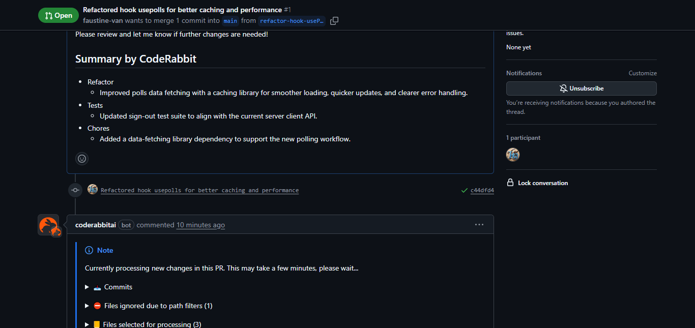
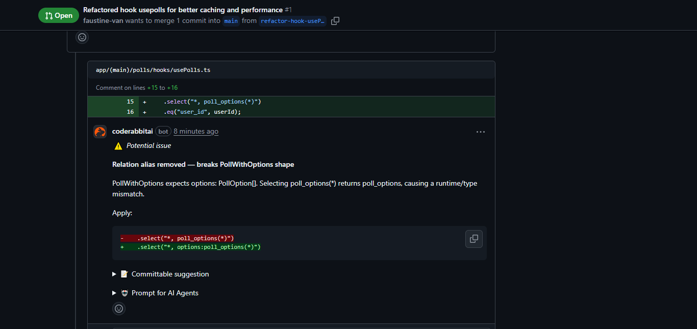
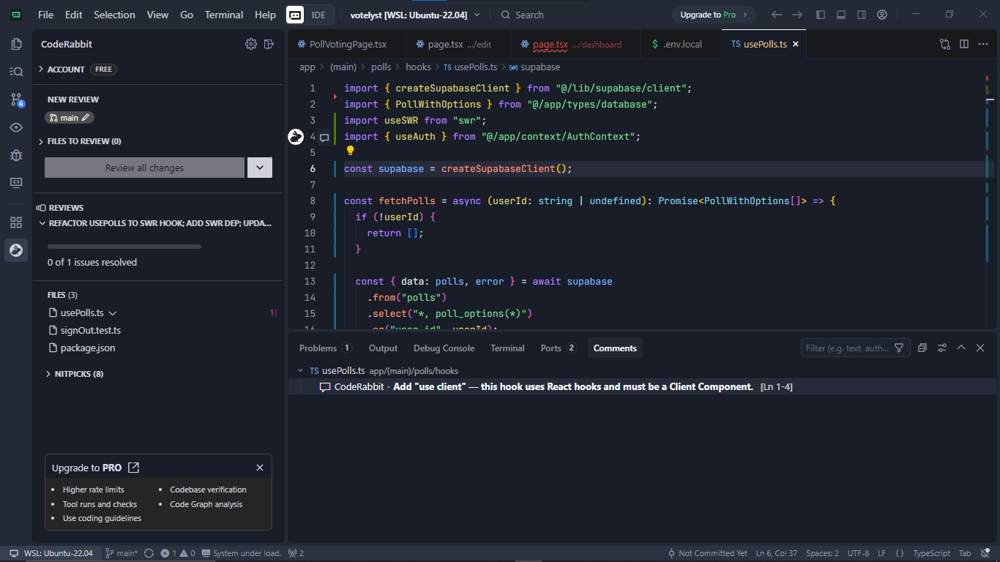

# Votelyst - A Modern Polling Application

Votelyst is a full-stack polling application built with Next.js and Supabase. It allows users to create, manage, and vote on polls, with real-time results and a comprehensive user dashboard.

## Features

- **User Authentication**: Secure sign-up, login, and session management powered by Supabase Auth.
- **Poll Management**: Create, edit, and delete polls.
- **Public & Private Polls**: Option to require user login for voting.
- **Real-time Voting**: Cast votes and see results update instantly.
- **Dashboard**: A central hub for users to view their polls, analytics, and manage their profile.
- **Analytics**: Visualize poll results with interactive charts.
- **Responsive UI**: Built with Tailwind CSS and Shadcn/UI for a clean and modern user experience on all devices.

## Tech Stack

- **Framework**: [Next.js](https://nextjs.org/) (App Router)
- **Backend & Database**: [Supabase](https://supabase.io/)
- **Styling**: [Tailwind CSS](https://tailwindcss.com/)
- **UI Components**: [Shadcn/UI](https://ui.shadcn.com/)
- **Data Fetching**: [SWR](https://swr.vercel.app/)
- **Testing**: [Jest](https://jestjs.io/) & [React Testing Library](https://testing-library.com/)
- **Language**: [TypeScript](https://www.typescriptlang.org/)

## Getting Started

Follow these instructions to get a local copy up and running.

### Prerequisites

- Node.js (v18.0.0 or newer)
- npm
- A Supabase account ([Create one for free](https://supabase.com/))

### Installation & Setup

1.  **Clone the repository:**
    ```bash
    git clone https://github.com/your-username/votelyst.git
    cd votelyst
    ```

2.  **Install dependencies:**
    ```bash
    npm install
    ```

3.  **Set up Supabase:**
    - Go to your [Supabase Dashboard](https://app.supabase.io) and create a new project.
    - Navigate to the **SQL Editor** in your new project.
    - Copy the contents of `supabase/schema.sql` and run it to create the database tables.
    - Copy the contents of `supabase/rls.sql` and run it to set up Row Level Security policies.
    - Go to **Project Settings** > **API**.
    - Find your **Project URL** and **anon public key**.

4.  **Configure Environment Variables:**
    - Create a `.env.local` file in the root of the project by copying the example file:
      ```bash
      cp .env.local.example .env.local
      ```
    - Add your Supabase URL and anon key to the `.env.local` file:
      ```
      NEXT_PUBLIC_SUPABASE_URL=your-supabase-project-url
      NEXT_PUBLIC_SUPABASE_ANON_KEY=your-supabase-anon-key
      ```

5.  **Run the development server:**
    ```bash
    npm run dev
    ```

Open [http://localhost:3000](http://localhost:3000) with your browser to see the result.

## Testing

This project uses Jest and React Testing Library for unit and integration tests. To run the test suite:

```bash
npm test
```

## Project Structure

The project follows the Next.js App Router structure.

```
/
├── app/
│   ├── (auth)/         # Authentication routes (login, register)
│   ├── (main)/         # Main application routes (dashboard, polls)
│   ├── api/            # API routes
│   ├── context/        # React Context providers (e.g., AuthContext)
│   ├── types/          # TypeScript type definitions
│   └── utils/          # Utility functions
├── components/
│   ├── ui/             # Shadcn/UI components
│   └── *.tsx           # Reusable application components
├── lib/
│   └── supabase/       # Supabase client, server, and middleware helpers
├── supabase/
│   ├── schema.sql      # Database table definitions
│   └── rls.sql         # Row Level Security policies
├── __tests__/
│   ├── actions/        # Tests for server actions
│   └── integration/    # Integration tests
├── public/             # Static assets
└── screenshots/        # Screenshots for README
```

## Deploy on Vercel

The easiest way to deploy your Next.js app is to use the [Vercel Platform](https://vercel.com/new).

Check out the [Next.js deployment documentation](https://nextjs.org/docs/app/building-your-application/deploying) for more details.

## CodeRabbit PR Review Screenshots

### PR Review on GitHub
\


### IDE Review Suggestions

